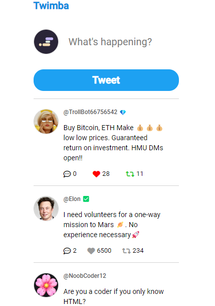
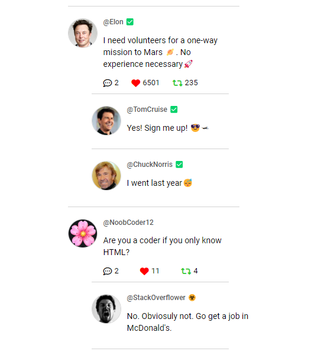

# Twitter

https://twitter-twimba.netlify.app/

A simple Twitter project. You can write and read comments there. And also, you can write on What's happening place and tweet it below. 






-----


## Languages and Tools are used 🛠 🗣️

1. **Languages**
    + [HTML](https://github.com/topics/html)
    + [HTML5](https://github.com/topics/html5)
    + [CSS](https://github.com/topics/css)
    + [CSS3](https://github.com/topics/css3)
    + [JavaScript](https://github.com/topics/javascript)

2. **Tools** 
    + [Chrome](https://github.com/topics/chrome)
    + [VSCode](https://github.com/topics/vscode)
    + [Figma](https://github.com/topics/figma)
    + [Netlify](https://github.com/topics/netlify)


-----


## For cloning the project 🪛

```
# Clone this repository
$ git clone MastooraTurkmen/Twitter

# Go inside the repository
$ cd Twitter

```


------

## Deployment📥

1. How to deploy our project to the Netlify site?
2. I use [Netlify App](https://app.netlify.com/) for deploying my projects.
4. From there select **_Deploy with Github_**.
5. Then write your project name and select it.
6. After selecting here you can see that the project **_Review configuration for twitter_** and then select the **_Deploy twitter_** Button.
7. Now your project is Live.


------


## Author 👩🏻‍💻 
**Mastoora Turkmen**  

[LinkedIn](https://www.linkedin.com/in/mastoora-turkmen/) 
<br>
[Github](https://github.com/MastooraTurkmen/) 
<br>
[Twitter](https://twitter.com/MastooraJ22)
<br>

